# 🛡️ Notion Recursive Backup to Private GitHub Repo

[](https://github.com/features/actions)
[](https://developers.notion.com/)
[](https://opensource.org/licenses/MIT)

An automated solution to backup your entire Notion workspace into **Markdown** files, using a specific root page tree.

This project is powered by the [notion-to-md](https://github.com/souvikinator/notion-to-md) library.

This workflow separates **Logic** from **Data**. The script runs in this repository, but commits the backup files to a **separate, private repository** of your choice.

## ✨ Key Features

- **📂 Structured Hierarchy**: The backup perfectly mirrors your Notion structure. Every sub-page is organized into its own folder, creating a clean, navigable file tree in your repository.
- **📜 Version Control & Diffs**: Uses Git to track every change. You can use GitHub's "History" and "Diff" views to see exactly what changed in your Notion pages over time.
* **🔄 Recursive Fetching**: Starts from a root page and traverses all sub-pages indefinitely.
- **📊 Databases as Tables**: Notion Databases (inline or full page) are converted into Markdown tables.
- **🔒 Privacy First**: Backups are pushed to a different, private repository.
- **⏱️ Scheduled & Automated**: Runs automatically every day at 02:00 UTC via GitHub Actions.
- **⚡ On-Demand Snapshots**: You can manually trigger the workflow immediately after making important edits in Notion to save a specific version.

---

## 📐 Architecture

```mermaid
graph LR
    A[Notion Workspace] -->|API Read| B(GitHub Action Runner)
    B -->|notion-to-md| B
    B -->|Git Push| C[🔒 Private Backup Repo]
```



### Workflow Steps

1. **Trigger**: The workflow starts (schedule or manual)
2. **Checkout**: It checks out this code repository and the data repository
3. **Fetch**: Connects to Notion API and recursively fetches pages
4. **Convert**: Converts page content to Markdown using notion-to-md
5. **Push**: Commits and pushes to the data repository if there are differences compared to the last pushed commit

---

## ⚠️ Important Limitations

- **Database Internals**: While databases are converted into tables (preserving the view), the content of the pages inside the database (the rows) is **NOT** backed up.
- **Images & Files**: Binary files (images, PDFs, attachments) are **NOT** downloaded. They appear in the Markdown as links pointing to Notion's servers. These links are temporary and usually expire after 1 hour.

---

## 💡 Required Practices for Notion Structure

To ensure the backup captures your data correctly, organize your Notion workspace as follows:

1. **Create a "root" page**: Do not try to use your entire Notion workspace. Instead, create a single page (e.g., named "Home"). Move all the other pages you want to backup inside this page. Use this specific page as the entry point for the script.
2. **Wrap databases in pages**: The script looks for pages to create the folder structure.
    - ❌ Don't: Create a database directly as a sub-page of your root page.
    - ✅ Do: Create a standard page first (e.g., "Project Finance"), and then place your database inside that page.
3. **Prioritize database views**: If a database has multiple views (Table, Gallery, etc.), the script will primarily backup the properties visible in the first view. Ensure the view you want to see in the Markdown table (usually the "Table" view with all relevant columns) is set as the first/default view in Notion.

---

## 🚀 Setup Guide

### Phase 1: Repository Setup

1. Fork this repository to your GitHub account.
2. Create a second, new repository (e.g., `my-notion-data`).
   - Set visibility to **Private**.
   - **Important**: Check "Add a README file" during creation (the repo must not be empty).

### Phase 2: Notion Configuration

1. Go to [Notion My Integrations](https://www.notion.so/my-integrations).
2. Click **New integration**.
   - Name: `Integration GitHub Backup`
   - Associated workspace: `your-workspace`
   - Type: Internal
3. Check the three box in `Content Capabilities`: `Read content`, `Update content` and `Insert content`. Then, save.
4. Copy the "Internal Integration Secret".
5. Open **Settings/Connections** in your Notion workspace.
6. Click `...` in your new integration > **Manage page access** > Select the top-level page of your Notion workspace you want to backup.
7. Click `...` (top-right) in your selected page > **Copy link** > Copy the **Page ID** (UUID format) from the URL:
   - URL format: `https://www.notion.so/Page-Title-51c3d7eed8c04132a9c106432528b92d?source=copy_link`
   - ID: `51c3d7ee-d8c0-4132-a9c1-06432528b92d`

### Phase 3: GitHub Permissions (PAT)

1. Go to **GitHub Settings** > **Developer settings** > **Personal access tokens** > **Fine-grained tokens**.
2. Click **Generate new token**.
   - Name: `Notion Backup PAT`
   - Expiration: Set to maximum (e.g., 1 year)
   - Repository access: Select "Only select repositories" and choose your data repository
   - Repository permissions: Set **Contents** to **Read and write**
3. Click **Generate token** and copy it immediately.

### Phase 4: Secrets Configuration

1. Go to your code repository (the fork).
2. Navigate to **Settings** > **Secrets and variables** > **Actions**.
3. Create the following **New repository secrets**:

| Secret Name | Description | Example Value |
|-------------|-------------|---------------|
| `NOTION_TOKEN` | Your Notion integration secret | `A1b2C3...` |
| `NOTION_ROOT_PAGE_ID` | The ID of the page to start from | `51c3d7ee-d8c...` |
| `BACKUP_REPO_NAME` | The path to your data repo | `your-username/my-notion-data` |
| `PERSONAL_ACCESS_TOKEN` | The GitHub fine-grained Token | `github_pat_...` |

---

## 🏃‍♂️ Usage

### Manual Run (Snapshots & Diff Check)

Want to check what changed after a big edit Notion session?

1. Go to the **Actions** tab in your public code repository (forked).
2. Select **Notion Backup to Separate Repository**.
3. Click **Run workflow**.
4. Once finished, go to your private data repository and click "Commits". You can select any commit to see the **Diff**.

### Automatic Schedule

The workflow is configured to run automatically every day at 02:00 UTC. You can change this in `.github/workflows/backup.yml`:

```yaml
on:
  schedule:
    - cron: '0 2 * * *' # Change this value to modify the schedule
```

---

## 📂 Output Structure

In your data repository, the structure will mirror your Notion hierarchy:

```
my-notion-data/
├── INDEX.md                # backup statistics
├── Root Page Name.md       # Content of the root page
├── Root Page Name/         # 📂 Folder for children pages of Root Page
│   ├── Project A.md        # Content of Project A page
│   ├── Project A/          # 📂 Folder for children pages of Project A
│   │   ├── Meeting Notes.md
│   │   └── Specs.md
│   └── Database View.md    # Contains the markdown table of the Database View page
└── README.md
```

---

## 📜 License

This project is licensed under the MIT License - see the [LICENSE](LICENSE) file for details.
